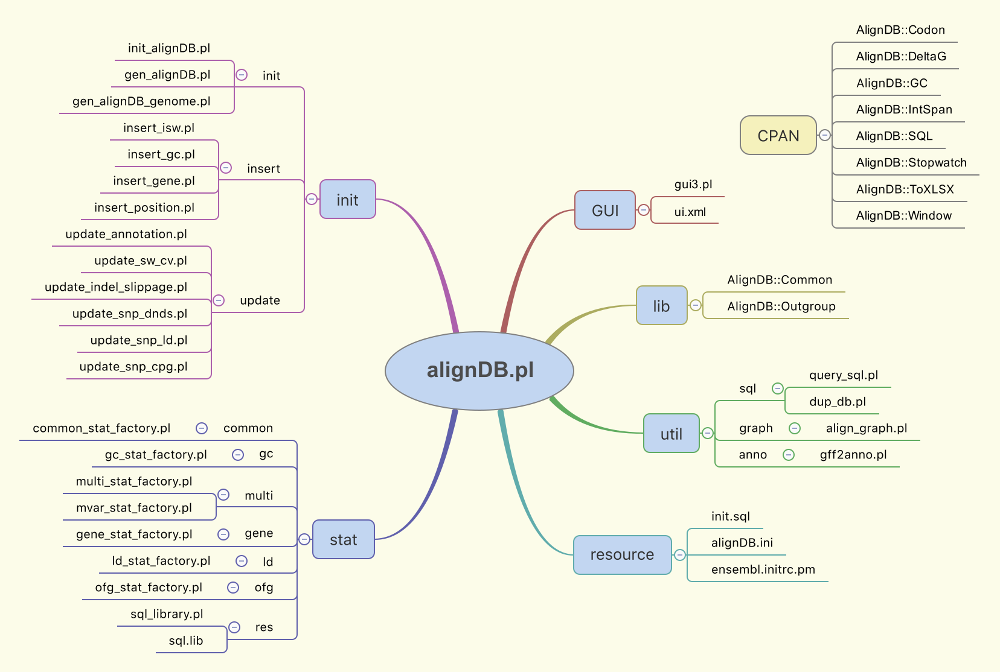

# alignDB

Analyze the relationship between indels and substitutions in genomic alignments.

## Data sources

### For this example

Detailed steps of building genomic alignments can be found
[here](https://github.com/wang-q/egaz/blob/master/doc/Scer-batch-example.md).

These steps are extracted from `Scer_wgs` section of
[`OPs-download.md`](https://github.com/wang-q/withncbi/blob/master/pop/OPs-download.md) and
[`OPs-align.md`](https://github.com/wang-q/withncbi/blob/master/pop/OPs-align.md).

### For files downloaded from [UCSC](http://hgdownload.soe.ucsc.edu/downloads.html)

UCSC provides two file formats:

* `.axt` for pairwise alignments
* `.maf` for multiple alignments

Both of them can be converted to blocked fasta format (.fas) used by `alignDB` via
[fasops](https://metacpan.org/pod/App::Fasops). Here's
[an example](https://github.com/wang-q/egaz/blob/master/doc/Scer-batch-example.md#fas-from-axt-files).

## Structure of source files



## Detailed steps starting from .fas files (two-way)

0. `cd ~/Scripts/alignDB`

1. `perl init/init_alignDB.pl -d S288cvsRM11_1a`

    ```
    Init [S288cvsRM11_1a]...
    Start at: Sat Dec 10 21:13:33 2016


    ==> Create DB skeleton

    * dropdb
    * createdb
    * init

    ==> Use [~/data/alignment/example/scer/chr_length.csv] to Init table chromosome


    End at: Sat Dec 10 21:13:33 2016
    Runtime 0 seconds.
    ```

2. `perl init/gen_alignDB.pl -d S288cvsRM11_1a --lt 5000 --parallel 2`

    ```
    Generate [S288cvsRM11_1a] from directory [~/data/alignment/example/S288cvsRM11_1a]...
    Start at: Sat Dec 10 21:42:40 2016


    ----Total .fas Files:   16----


    ==> Process task [2] by worker #2. [II.net.axt.gz.fas]


    ==> Process task [1] by worker #1. [I.net.axt.gz.fas]

    Prosess align [1] at S288c.I(+):17221-24930
    Prosess align [2] at S288c.II(+):9425-29638
    Prosess align [3] at S288c.I(+):27070-160233

    ...
    
    Prosess align [205] at S288c.XVI(+):856555-927349
    Prosess align [206] at S288c.XVI(+):927529-936894

    ==> [XVI.net.axt.gz.fas] has been processed.
    ==> Runtime 8 seconds.


    All files have been processed.
    End at: Sat Dec 10 21:17:32 2016
    Runtime 54 seconds.
    ```

3. `perl init/insert_isw.pl -d S288cvsRM11_1a --parallel 2`

    ```
    Update isw-indel relationship of [S288cvsRM11_1a]...
    Start at: Sat Dec 10 21:58:12 2016

    Emptying tables...

    ==> Process task [2] by worker #2


    ==> Process task [1] by worker #1

    Process align [1] at S288c.I(+):17221-24930
    Process align [51] at S288c.IV(+):758865-871820
    Process align [2] at S288c.II(+):9425-29638

    ...

    Process align [205] at S288c.XVI(+):856555-927349
    Process align [206] at S288c.XVI(+):927529-936894

    End at: Sat Dec 10 21:59:04 2016
    Runtime 52 seconds.
    ```

4. `perl init/insert_gc.pl -d S288cvsRM11_1a --parallel 2`

    ```
    Runtime 2 minutes and 21 seconds.
    ```

5. `perl init/update_sw_cv.pl -d S288cvsRM11_1a --parallel 2`

    ```
    Runtime 43 seconds.
    ```

6. `perl init/update_annotation.pl -d S288cvsRM11_1a --parallel 2`

    ```
    Runtime 1 minute and 2 seconds.
    ```

7. `perl init/update_indel_slippage.pl -d S288cvsRM11_1a`

    ```
    Runtime 0 seconds.
    ```

8. `perl stat/common_stat_factory.pl -d S288cvsRM11_1a`

    ```
    Do stat for S288cvsRM11_1a...
    Start at: Fri Dec  9 02:14:54 2016

    Sheet [basic] has been generated.
    Sheet [process] has been generated.
    Sheet [summary] has been generated.
    Sheet [d1_pi_gc_cv] has been generated.
    Sheet [d2_pi_gc_cv] has been generated.
    Sheet [d1_comb_pi_gc_cv] has been generated.
    Sheet [d2_comb_pi_gc_cv] has been generated.
    Sheet [group_distance] has been generated.
    Sheet [group_density] has been generated.
    Sheet [d1_comb_coding] has been generated.
    Sheet [d1_comb_non_coding] has been generated.
    Sheet [d2_comb_coding] has been generated.
    Sheet [d2_comb_non_coding] has been generated.
    Sheet [d1_comb_slippage] has been generated.
    Sheet [d1_comb_non_slippage] has been generated.
    Sheet [d2_comb_slippage] has been generated.
    Sheet [d2_comb_non_slippage] has been generated.
    Sheet [dd_group] has been generated.
    Sheet [dd_group_gc] has been generated.
    Sheet [indel_length_group] has been generated.
    Sheet [indel_extand_group] has been generated.
    Sheet [indel_position_group] has been generated.
    Sheet [indel_coding_group] has been generated.
    Sheet [indel_repeat_group] has been generated.
    Sheet [indel_slip_group] has been generated.
    Sheet [indel_gc_group] has been generated.
    Sheet [snp_indel_ratio] has been generated.
    Sheet [indel_length] has been generated.
    Sheet [indel_length_100] has been generated.
    Sheet [distance_snp] has been generated.
    Sheet [density_snp] has been generated.
    Sheet [distance_tri_trv] has been generated.

    End at: Fri Dec  9 02:14:59 2016
    Runtime 5 seconds.
    ```

## A gtk3 based GUI

`perl alignDB.pl -r gui` or `perl gui/gui3.pl`.

## Two-way batch

Use `build_ensembl.pl` to build a local ensembl database.

If don't use scripts in `gene/*`, local ensembl database names are arbitrary.

```bash
perl ~/Scripts/withncbi/ensembl/build_ensembl.pl --initdb --db saccharomyces_cerevisiae_core_29_82_4 \
    --ensembl ~/data/ensembl82/mysql/saccharomyces_cerevisiae_core_29_82_4

perl ~/Scripts/withncbi/ensembl/build_ensembl.pl --initdb --db yeast \
    --ensembl ~/data/ensembl82/mysql/saccharomyces_cerevisiae_core_29_82_4

```

`--ensembl yeast` means different in step 20 and 22. In step 20, `yeast` is the mysql database name.
And in step 22, `yeast` is an alias to `saccharomyces_cerevisiae_core_29_82_4`.

```bash
# S288cvsRM11_1a
perl ~/Scripts/alignDB/alignDB.pl \
    -d S288cvsRM11_1a \
    --da ~/data/alignment/example/S288cvsRM11_1a \
    --ensembl yeast \
    --lt 5000 \
    --parallel 2 \
    -r all

```

## Multi-way batch

```bash
perl ~/Scripts/alignDB/alignDB.pl \
    -d ScervsRM11_1a_Spar \
    --da ~/data/alignment/example/scer/Scer_n2_Spar_refined \
    --ensembl yeast \
    --outgroup \
    --lt 5000 --parallel 2 \
    --run all

```

## Slicing

### Yeast intergenic regions

* multi-way (fas)

```bash
mkdir -p ~/data/alignment/example/feature
cd ~/data/alignment/example/feature

perl ~/Scripts/alignDB/util/write_runlist_feature.pl \
    -e yeast --feature intergenic

find ~/data/alignment/example/scer/Scer_n2_Spar_refined -name "*.fas" -or -name "*.fas.gz" \
    | parallel --no-run-if-empty -j 8 \
        fasops slice {} yeast.intergenic.yml \
        --name S288c \
        -o ~/data/alignment/example/feature/{/}.fas

perl ~/Scripts/alignDB/alignDB.pl \
    -d S288cvsRM11_1a_intergenic \
    --da . \
    --lt 1000 \
    --parallel 8 \
    --run basic
```

## Speed test

### Two-way

```bash
perl ~/Scripts/alignDB/alignDB.pl \
    -d S288cvsRM11_1a \
    -a ~/data/alignment/example/anno.yml \
    --da ~/data/alignment/example/S288cvsRM11_1a \
    --chr ~/data/alignment/example/scer/chr_length.csv \
    -e saccharomyces_cerevisiae_core_29_82_4 \
    --lt 10000 \
    --parallel 4 --batch 10 \
    --run common

```

* On Hackintosh (i7-6700k 32G SSD)
    * `--parallel 4`: 1m44s
    * `--parallel 8`: 1m39s

* On server (E5-2690 v3 128G SSD)
    * `--parallel 4`: 2m8s
    * `--parallel 8`: 1m28s
    * `--parallel 16`: 1m15s

* On Hackintosh (i7-4790k 16G SSD)
    * `--parallel 4`: 2m52s
    * `--parallel 8`: 2m50s

* On server (E5-2690 256G HDD)
    * `--parallel 4`: 4m32s

* On macbook pro (mid 2014)
    * `--parallel 4`: 4m5s

* On desktop pc (E3-1245 v2 Windows)
    * `--parallel 4`: 6m9s

### Multi-way

```bash
perl ~/Scripts/alignDB/alignDB.pl \
    -d Scer_n4 \
    -a ~/data/alignment/example/anno.yml \
    --da ~/data/alignment/example/scer/plan_ALL_refined \
    --chr ~/data/alignment/example/scer/chr_length.csv \
    -e saccharomyces_cerevisiae_core_29_82_4 \
    --lt 5000 \
    --parallel 4 --batch 10 \
    --run common
```

* On Hackintosh (i7-6700k 32G SSD)
    * `--parallel 4`: 5m57s
    * `--parallel 8`: 6m20s

* On server (E5-2690 v3 128G SSD)
    * `--parallel 4`: 6m2s
    * `--parallel 8`: 5m33s

### Multi-way (outgroup)

```bash
perl ~/Scripts/alignDB/alignDB.pl \
    -d Scer_n3_Spar \
    -a ~/data/alignment/example/anno.yml \
    --da ~/data/alignment/example/scer/Scer_n3_Spar_refined \
    --chr ~/data/alignment/example/scer/chr_length.csv \
    -e saccharomyces_cerevisiae_core_29_82_4 \
    --lt 5000 \
    --outgroup \
    --parallel 4 --batch 10 \
    --run common
```

* On Hackintosh (i7-6700k 32G SSD)
    * `--parallel 4`: 5m57s
    * `--parallel 8`: 6m24s

* On server (E5-2690 v3 128G SSD)
    * `--parallel 4`: 6m2s
    * `--parallel 8`: 1m56s
