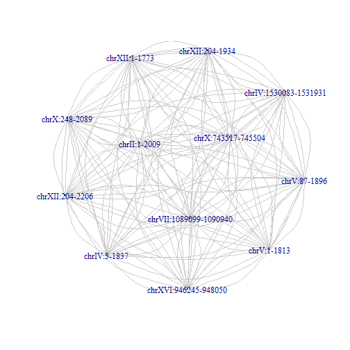

# try igraph


```
## [1] "d:/data/alignment/self_alignment/S288Cvsselfalign.match.tsv"
```

```
## [1] "d:/data/alignment/self_alignment/S288Cvsselfalign.blast.tsv"
```


```
## [1] 1367
```

```
## [1] 454
```

```
## [1] 3
```

```
## [1]  17 377   3
```


```r
lc <- largest.cliques(g)
# create a new graph of the largest clique
V(g)$label <- V(g)$name
g.lc <- subgraph(g, lc[[1]])
```

```
## Warning: At structural_properties.c:1847 :igraph_subgraph is deprecated
## from igraph 0.6, use igraph_induced_subgraph instead
```

```r

plot(g.lc, layout = layout.fruchterman.reingold, vertex.color = "gray60", vertex.size = 0, 
    edge.arrow.size = 0.5, edge.color = "gray80")
```

 

```r

```

